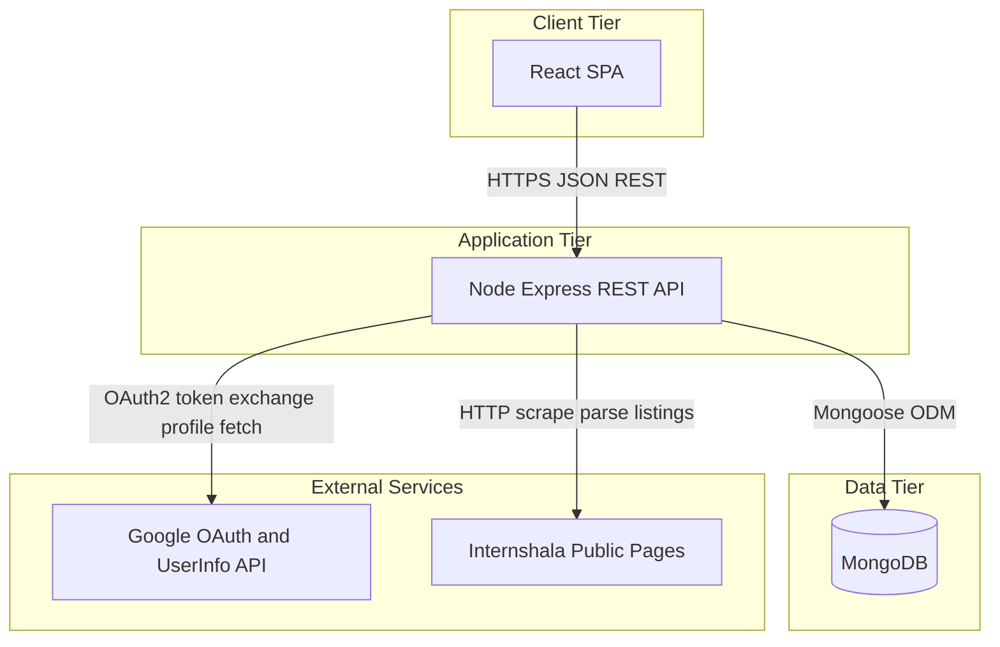
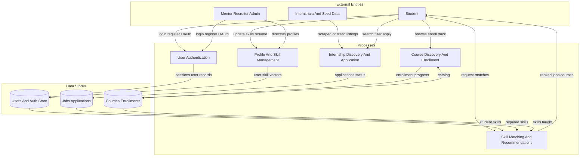
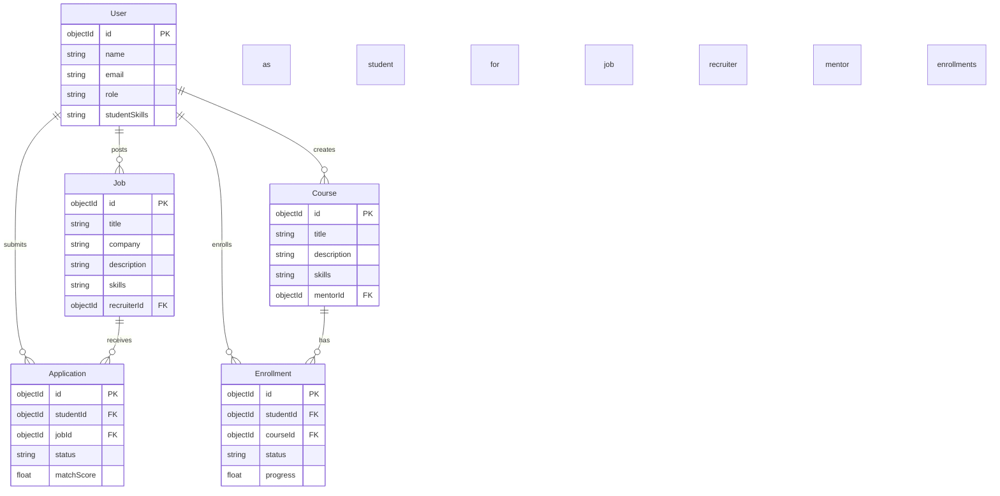

# Section 3 — System Design

This section documents the Career Navigator stack at a high level: **React** (client), **Node.js / Express** (API), **MongoDB** (persistence), **Google OAuth** for social login, and **Internshala** as a scraped source for additional internship listings. Persisted internship postings are **`Job`** documents in `server/src/models/`; the ER diagram below matches `user`, `job`, `application`, `course`, and `enrollment` models and route mounts in `server/src/app.ts`.

**Raster exports** for templates that need images: `docs/diagrams/section-3/3-1-architecture.png`, `3-2-data-flow.png`, `3-3-er.png` (generated from the sibling `.mmd` sources via `@mermaid-js/mermaid-cli` and `puppeteer-config.json`).

---

## 3.1 Architecture Overview

The architecture is organized into four logical tiers. The **client tier** is a React single-page application in the browser; it communicates with the backend only over HTTPS using JSON-based REST calls. The **application tier** is a Node.js **Express** server that implements authentication, business rules, skill matching, job and course workflows, and integrations. Durable state is written through **Mongoose** to **MongoDB** in the **data tier**, including users, jobs (internship postings), applications, courses, enrollments, and related records. The **external services** tier covers dependencies outside the core stack: **Google OAuth** supports delegated login and profile retrieval via Google’s userinfo endpoint, while **Internshala** is not a formal API here—the server retrieves public HTML and parses listings to augment internally stored or seeded opportunities. This separation clarifies presentation, API logic, storage, and third-party boundaries for deployment, security, and scaling discussions typical of a three-tier style design.

---

## 3.2 Data Flow Diagram

This data-flow view emphasizes **who** originates data, **which processes** transform it, and **where** it is stored—not individual REST endpoints. **Students** authenticate, maintain profiles and skills, request matches, search and apply for internships, and browse or enroll in courses. **Mentors, recruiters, and admins** mainly contribute through authentication, directory-style profiles, and data that still lands in the same logical stores. **User authentication** updates **users and auth-related state** so later actions are authorized. **Profile and skill management** keeps student skill data consistent with what matching and recommendations need. **Skill matching** combines student skills with job-required skills and course skill tags to return ranked suggestions. **Internship discovery** blends **Internshala and seed** listings with persisted jobs and writes **applications and status** to the jobs/applications store. **Course discovery** reads the catalog, records **enrollment and progress**, and returns updates to the student. Arrow direction shows information flow at a logical level rather than every HTTP request–response pair.

---

## 3.3 Entity Relationship Diagram

Figure 3.3 is a **logical, conceptual** view of how major pieces relate; the narrative below interprets it for MongoDB.

The ER diagram approximates a **document database**: entities align with collections (or summarized structures) rather than a normalized relational schema. A **User** can represent students, mentors, or recruiters (via **role**); **studentSkills** is modeled as a list of strings, not a separate Skill entity. **Job** stands for internship postings tied to a recruiter (**recruiterId**), with **skills** as strings on the job. **Application** links a student to a job and holds **status** and **matchScore**. **Course** is mentor-authored content (**mentorId**) with **skills** taught. **Enrollment** links a student to a course with **status** and **progress**. Cardinalities follow the usual reading: many applications per user and per job, many jobs per recruiter, many courses per mentor, many enrollments per user and per course. Embedded arrays and subdocuments (for example course **modules**) are left out so the figure stays readable while still matching the main references in the server models. Where the report says “Internship,” persisted openings correspond to **Job** documents in storage.
